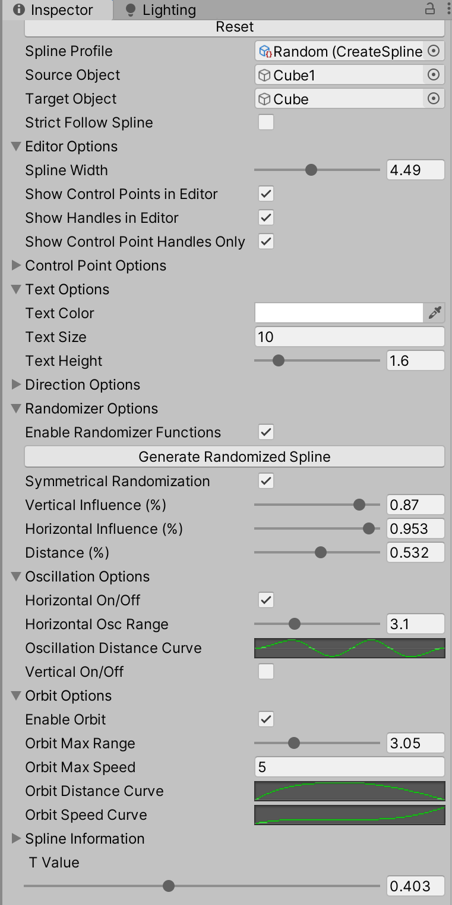
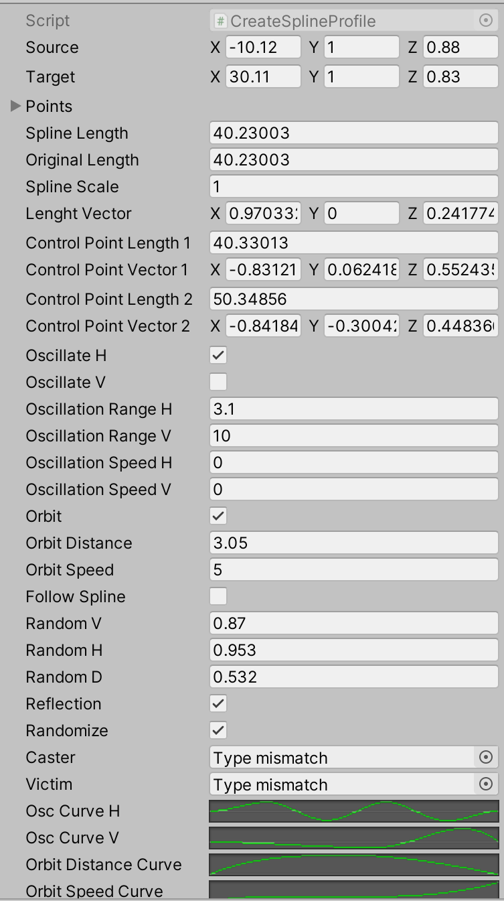
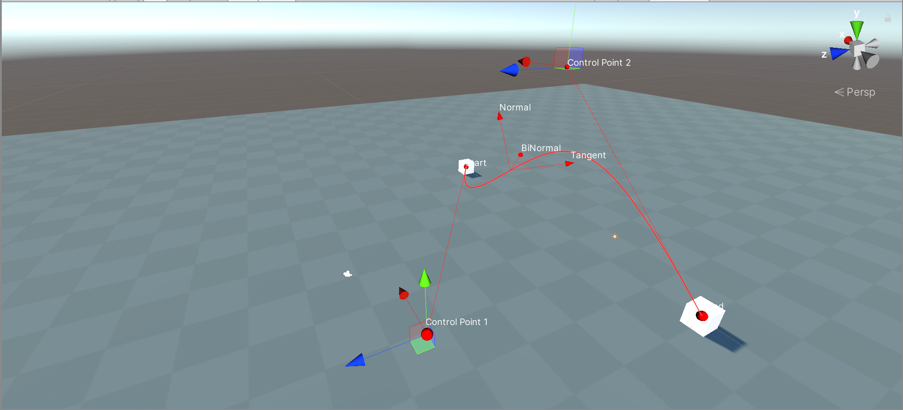

# Spline Tools

A novel system for crating animations and pathing using Splines/bezier curves in the Unity 3D engine. Originally developed to compliment the FOE MMO/MOBA combat systems. A version of the complete project is available [here](https://github.com/deserializeme/Game-Projects/tree/main/combat_system)

<figure markdown> <!--  -->
  
  <figcaption>Editor view</figcaption>
</figure>

## Motivation

Inspired by this artists video-essay:
[How the fundamentals of animation apply to game design with League of Legends](https://www.youtube.com/watch?v=rXLH0nkgkbc)

!!! Warning
    
    Warning: depicts some anime violence - skip to 1:30 to bypass.

## Goals

1. Reduce difficulty prototyping complex ability interraction chains

- getting meaningful logging data

- Create tools to implement essential principles of animation in the movement of non-ambulatory actors

- Ability to randomly seed/generate abilities and animations to kick-start the creative process

    !!! Tip
      
        Special thanks to @FreyaHolmer's 2015 Unite presentation on the subject for being a fantastic primer.
    

## Examples

1. "Justice rains from above..."

<figure markdown> <!--  -->
    <video playsinline autoplay loop muted src="https://thumbs.gfycat.com/FemaleFaithfulBorderterrier-mobile.mp4">
    </video>
  <figcaption>Recreating Pharah from Overwatch's Ultimate using random spline reflection</figcaption>
</figure>

2. loopy loops

<figure markdown> <!--  -->
    <video playsinline autoplay loop muted src="https://thumbs.gfycat.com/ThoroughSeriousIchidna-mobile.mp4">
    </video>
  <figcaption>object showing the "orbit" option to rotate around the spline path, then switching to a direct flight path, then adding a status effect to the target</figcaption>
</figure>

2. Editor and Game views

<figure markdown> <!--  -->
    <video playsinline autoplay loop muted src="https://thumbs.gfycat.com/HollowMajesticArmadillo-mobile.mp4">
    </video>
  <figcaption>Switching between the game and Editor views while an animation plays. This shows the custom editor gizmos created to help customize spline paths and animations</figcaption>
</figure>

# Custom Editors

1. Spline Manager

    ??? Note
    
        

2. Spline Profile

    ??? Note

        

3. Editor Gizmos

    ??? Note

        