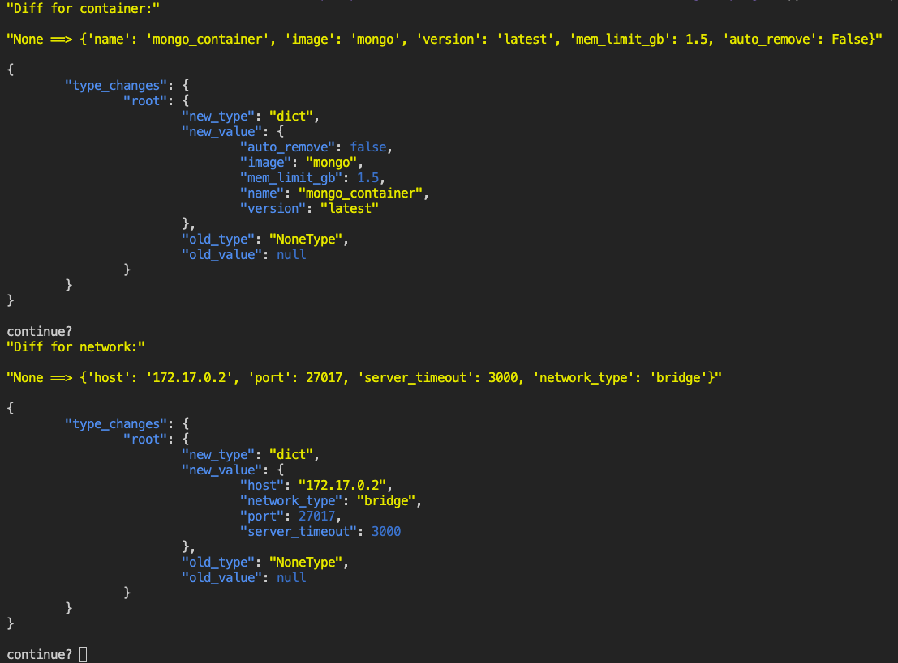

# I/O Tools

___
Data/file manipulation tools to prevent me from having to write out json serialization a million times. Tries to make you code your variables in a a way that can shift now and easily to be lifted later. Best used as a submodule and then replaced with an ORM, Memory Cache, or NoSQL DB when you have one. might push to pypy or snap at some point.

## Usage

- See demo.py for serialization, de-serialization, and format conversion examples.
___


__To Run the demo:__

```bash
# cd to the program folder
cd io_tools

# install dependencies
pip3 install -r requirements.txt

# run the script
python3 demo.py

```

__Step by step in:__

```zsh
python3
```

```python

import io_tools as io
import json

settings = {}
vars = io.Variables(settings)
vars.debug = True
vars.go_steppy = False
vars.yaml_input_file = "pref_input_test.yaml"
vars.json_input_file = "cache.json"

# reads a file of TYPE
vars.yaml_file_contents = io.read_yaml_file(vars.yaml_input_file)
vars.json_file_contents = io.read_json_file(vars.json_input_file)

# print as pretty json
io.print_pretty(vars.json_file_contents, vars.debug, "json")
io.print_pretty(vars.yaml_file_contents, vars.debug, "json")

# print as compact json
print(vars.__dict__)

# Serialize
json_string = print(vars.__dict__) 
io.write_file('cache.json', vars.__dict__, vars.debug)

# Can write CSVs as well, but only working properly on non-nested files. WIP.
csv = io.json_to_csv('cache.json')
```

## Class Methods

___
### Datastore

 Datastore is a `<key>:<value>` dict that accepts any  types and is used for portability. It achieves this  by storing all variables in a generic dictionary  with the `change()` method overriden to be an event system.

### Variables

 Object that holds a list of `Datastore()`s,
 When eneabled, the built-in `go_steppy()` function  will pause script execution on any memory state  change to provide a json formatted diff. for example:

 

  change_value:
    Triggered when any variable within the `Datastore()`  is updated, or created.
  get_current_value:
    Returns the current value of a variable within the `Datastore()`, and triggers an event.
  diff_values:
    When enabled, deepdiffs the current and proposed change to the `Datastore()` object
